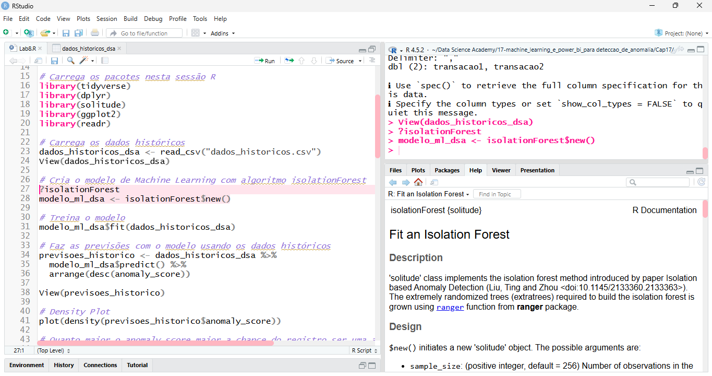

# 🌸 Rosa Claro Total — RStudio Theme

**Rosa Claro Total** is a custom **RStudio theme** designed to provide a **soft, elegant, and comfortable** visual experience, with a predominant light pink color palette.  
Ideal for those who spend long hours coding and want a lighter, modern, and stylish development environment.

---

## ✨ Theme Features

- 🎀 **Light pink** color palette, balanced and easy on the eyes
- 👀 Excellent contrast for code readability
- 💻 Harmonious highlighting for:
  - Functions
  - Strings
  - Comments
  - Keywords
- 🌙 Works well in light environments
- 💖 Clean and minimalist style

---

## 📸 Preview



---

## 🚀 How to Install in RStudio

### Option 1 — Manual Installation

1. Download the theme file:
   ```text
   Rosa_Claro_Total.rstheme
   ```
2. Open **RStudio**
3. Go to:
   ```text
   Tools → Global Options → Appearance
   ```
4. Click **Add More**
5. Select the file `Rosa_Claro_Total.rstheme`
6. Apply the theme 🎉

---

### Option 2 — Import Directly

In RStudio:

```text
Tools → Global Options → Appearance → Add → Import
```

---

## 🛠️ Technologies Used

- RStudio Theme (`.rstheme`)
- Customization based on **CSS for the RStudio editor**

---

## 🎯 Target Audience

- Data Analysts
- Data Scientists
- R Developers
- Data Science Students
- People who enjoy an **aesthetic and pleasant** coding environment

---

## 💡 Motivation

Created to combine **productivity and visual identity**, the **Rosa Claro Total** theme was born from the idea of making the development environment more welcoming without sacrificing clarity and readability.

---

## 📄 License

This project is licensed under the **MIT License**.  
Feel free to use, modify, and share 💕

---

## 🤝 Contributions

Contributions are welcome!  
If you have suggestions for improvements, feel free to open an *issue* or submit a *pull request*.

---

## 💬 Contact

Created by **Suami Rocha**  
[LinkedIn](https://www.linkedin.com/in/surocham/)

---

✨ If you like this theme, don’t forget to leave a ⭐ on the repository!
